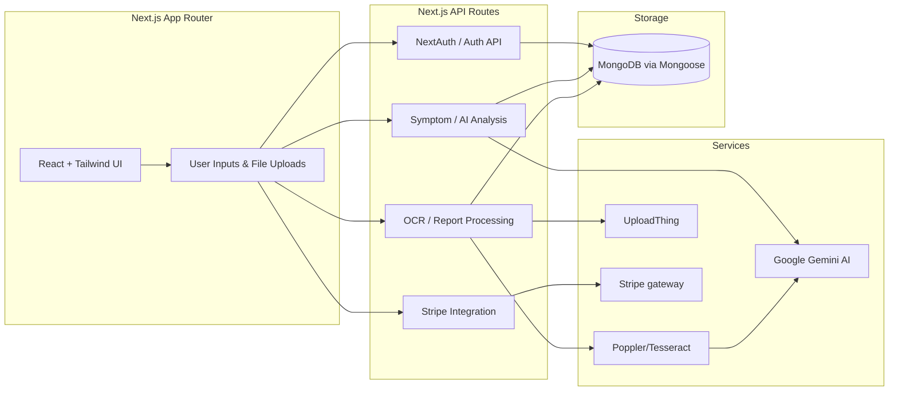
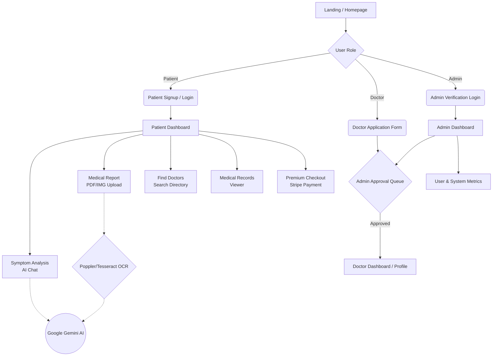

# Medicare-AI Website Workflow

Based on the project's documentation, here is the complete flow of the Medicare-AI website, from architecture to user journeys.

---

## 1. High-Level Architecture

The platform follows a modern full-stack architecture powered by Next.js, with the frontend and backend tightly integrated alongside various external services.

---

## 2. Platform User Journeys

The website primarily caters to **Patients**, **Doctors**, and **Admins**. Here is how users navigate through the primary features.

### Breaking Down the Patient Experience:
1. **Onboarding:** Patients create an account or log in securely (managed via NextAuth).
2. **AI Health Assistant:** An intelligent chat interface where patients describe symptoms. The chat history is packaged and sent to the **Gemini AI** to simulate a doctor's preliminary insight and return empathetic recommendations.
3. **Report Analyzer:** Patients upload raw lab results or documents (PDFs/Images via UploadThing). The backend extracts text using **Poppler/Tesseract**, feeds it to AI, and returns a translated summary of complex medical jargon.
4. **Care Directory:** A searchable directory (with map/filters) connecting patients to specialized, localized care.
5. **Medical Vault:** Persistent storage mapping to MongoDB, allowing patients to look back at past AI diagnoses and uploaded records.

### Breaking Down the Doctor & Admin Experience:
1. **Application:** To maintain legitimacy, Doctors cannot instantly use the platform. They submit their credentials through an application funnel.
2. **Review Pipeline:** Admins intercept these applications, reviewing certifications and metrics.
3. **Approval:** Once approved by an Admin, the professional gains access to the fully-featured Doctor Dashboard to interact with the platform.

> [!TIP]
> The AI processing relies on forming highly specific contextual prompts for Gemini. For Medical Reports, the pipeline extracts raw text locally before asking Gemini for its interpretation, ensuring maximum accuracy without sending raw files blindly to the LLM.
